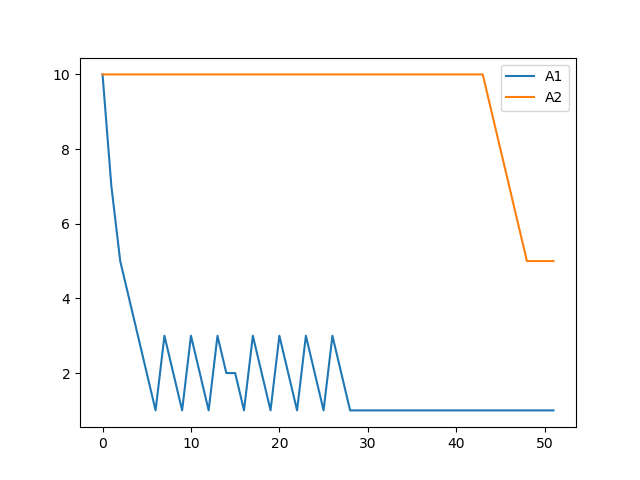

# Controlling-Epidemics-and-Economics-Activity-in-Interacting-Communities  
Resrach Project done as part of "Supervised Research Exposition"  

## Problem Statement  
We consider an SAIR model between two communities and try maximise their economic activity. The problem statement is practical considering the COVID-19 pandemic  
where the government and each individual is put into a tradeoff situation where he wants to maximise his economics at the same time not expose too much that he gets infected. For a simpler case, we assume 2 commnities interacting, a sparse and rich community C1 and a densely populated and poor community C2  

## Code
The coding has been done for simulation of the first objective function as proposed in the Report. Dynamic programming has been used across states. A window frame  
also has been used (Time upto which function should be optimized). At each time step, optimal control parameters are computed. Following are the preliminary results  for 54 epochs.  
S = Susceptible, I = Infected, A = Asymptomatic, R = Recovered. There are 2 communities involved hence they are indexed by 1 or 2 to represent the state respectively for each community. The code takes about 4-5 hours with the current parameters, since the state space is relatively huge.  

## Results

    
    
    
    
  

## References
[SIR + Economic Model](https://ideas.repec.org/a/red/issued/20-237.html)  
[SIRNC Model for Recursive model](https://arxiv.org/pdf/2010.06445.pdf)  
[Hota SIR Model](https://arxiv.org/pdf/2006.16185.pdf)
